# 💼 ProHireX

## 📑 Índice
1. [📝 Descripción del Proyecto](#📝-descripción-del-proyecto)
2. [🛠️ Tecnologías Utilizadas](#🛠️-tecnologías-utilizadas)
   - 2.1 [Backend](#backend)
   - 2.2 [Frontend](#frontend)
3. [🎨 Vistas de la Aplicación](#🎨-vistas-de-la-aplicación)
   - 3.1 [🏠 Home](#🏠-home)
   - 3.2 [🛒 Shop](#🛒-shop)
   - 3.3 [📑 Detalles de la Oferta de Trabajo](#📑-detalles-de-la-oferta-de-trabajo)
   - 3.4 [📝🔑 Register y Login](#📝🔑-register-y-login)
   - 3.5 [🧑‍💻 Profile del Usuario Candidato](#🧑‍💻-profile-del-usuario-candidato)
   - 3.6 [🏢 Dashboard de Empresa](#🏢-dashboard-de-empresa)
   - 3.7 [🛠️ Dashboard de Administrador](#🛠️-dashboard-de-administrador)
4. [🚀 Como Ejecutar el Proyecto](#🚀-como-ejecutar-el-proyecto)


## 📝 Descripción del Proyecto
Este proyecto es una plataforma de búsqueda de empleo diseñada para conectar a **candidatos**, **empresas** y **administradores**, optimizando el proceso de contratación y la búsqueda de empleo de manera sencilla y efectiva.

### Funcionalidades:

- **Candidatos (Clientes)**: 
  - Navegar por ofertas de trabajo.
  - Postularse a trabajos de su interés.
  - Dar me gusta a las ofertas.
  - Seguir a otros candidatos.
  - Comentar en las ofertas de trabajo.
  - Gestionar su perfil personal (ver seguidores, seguidos, trabajos favoritos y actualizar su perfil).

- **Empresas**: 
  - Crear ofertas de trabajo.
  - Ver el estado de las ofertas publicadas.

- **Administradores**:
  - Aceptar o rechazar ofertas creadas por empresas.
  - Aceptar o rechazar las aplicaciones de los candidatos.

Este sistema facilita la conexión entre empresas y candidatos de manera **intuitiva** y **efectiva**, mejorando la experiencia de la contratación.

## 🛠️ Tecnologías Utilizadas
Este proyecto utiliza una variedad de tecnologías modernas para asegurar su rendimiento, seguridad y escalabilidad.

<p align="center">
  <a href="https://skillicons.dev">
    
  </a>
  <a href="https://jwt.io" rel="nofollow">
    
  </a>&nbsp;&nbsp;&nbsp;&nbsp;&nbsp;&nbsp;
  <a href="https://skillicons.dev">
    
  </a>&nbsp;&nbsp;&nbsp;&nbsp;&nbsp;&nbsp;
  <a href="https://skillicons.dev">
    
  </a>
</p>

### Backend

- **Node.js**: Entorno de ejecución para JavaScript en el servidor, que permite ejecutar código fuera del navegador.
- **Express.js**: Framework para Node.js que facilita la creación de APIs RESTful.
- **TypeORM**: ORM que se utiliza principalmente para interactuar con bases de datos relacionales SQL como MySQL, PostgreSQL, SQLite y MSSQL. Sin embargo, también ofrece soporte para bases de datos NoSQL, como MongoDB.
- **Prisma**: ORM para bases de datos SQL y NoSQL, utilizado para interactuar de manera eficiente con MongoDB y otras bases de datos.
- **MongoDB**: Base de datos NoSQL, flexible y escalable, utilizada para almacenar datos de manera no estructurada.
- **Mongoose**: Biblioteca que simplifica el uso de MongoDB con Node.js, proporcionando modelos y validaciones.
- **JWT (JSON Web Tokens)**: Utilizado para la autenticación y autorización mediante tokens de sesión, lo que facilita el manejo de usuarios y sus permisos.
- **Argon2**: Algoritmo de hashing de contraseñas utilizado para almacenar las contraseñas de los usuarios de manera segura.

### Frontend

- **Angular**: Framework para construir aplicaciones web dinámicas de una sola página (SPA), ideal para desarrollar interfaces interactivas.
- **TypeScript**: Superset de JavaScript que añade tipado estático y mejora la experiencia de desarrollo.
- **HTML**: Lenguaje de marcado para estructurar contenido web.
- **CSS**: Lenguaje de estilos utilizado para diseñar la apariencia de las páginas web.

## 🎨 Vistas de la Aplicación
Aquí se muestran las principales vistas de la aplicación junto con una descripción de lo que cada sección ofrece al usuario.

### 🏠 Home

La página de inicio es el punto de entrada a la plataforma, donde los usuarios pueden explorar las oportunidades de empleo de manera visual e intuitiva.

- **Carrusel de Categorías**: La página cuenta con un carrusel interactivo que muestra las principales categorías de trabajo disponibles. Al hacer clic en cualquiera de las categorías en el carrusel, el usuario es redirigido a la sección de **Shop**, donde puede explorar en detalle las ofertas de trabajo correspondientes a la categoría seleccionada.

  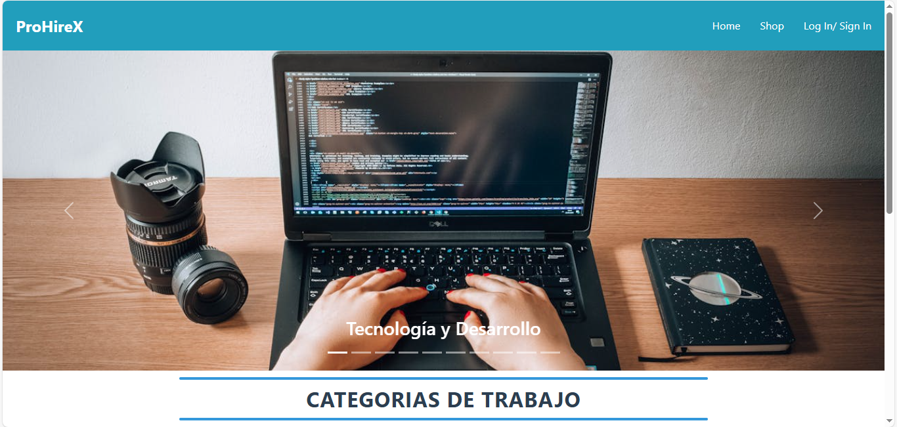

- **Tarjetas de Categorías con Desplazamiento**: Además del carrusel, la página de inicio presenta tarjetas individuales para cada categoría de empleo. Estas tarjetas están organizadas verticalmente y, al desplazarse hacia abajo, el usuario puede explorar todas las categorías disponibles mediante un scroll infinito. Cada tarjeta permite acceder directamente a la vista **Shop**, donde se muestra una lista filtrada de ofertas laborales de la categoría seleccionada.

  

Este diseño facilita una navegación fluida y continua, ayudando a los usuarios a encontrar trabajos en áreas de su interés de forma rápida y organizada.


### 🛒 Shop

La página **Shop** es la sección principal donde los usuarios pueden explorar las ofertas de empleo disponibles. A través de varias herramientas de búsqueda y filtros, **Shop** permite encontrar oportunidades laborales de forma rápida y personalizada. La página **Shop** es accesible desde la **Home**, mediante el carrusel de categorías o haciendo clic en las tarjetas de categoría, y también se puede acceder directamente desde el **header** de la aplicación.


#### 🔍 Búsqueda de Trabajo
- **Búsqueda por Nombre del Trabajo**: Los usuarios pueden buscar ofertas de trabajo utilizando un campo de búsqueda que tiene en cuenta las mayúsculas y minúsculas, para obtener resultados más precisos.

#### 📊 Filtros
- **Filtro de Categoría**: Selecciona categorías específicas para ver solo las ofertas de trabajo relevantes a esa industria o área.
- **Filtro de Salario**: Permite especificar un rango de salario mínimo y máximo, mostrando solo aquellas ofertas que cumplen con las expectativas salariales definidas.
- **Combinación de Filtros**: Los usuarios pueden combinar todos los filtros (nombre, categoría, salario) para una búsqueda más minuciosa, generando resultados específicos que se ajusten a sus preferencias.

#### 🔄 Restablecimiento de Filtros
- **Borrado de Filtros**: Los filtros aplicados se pueden restablecer en cualquier momento para que el usuario vuelva a ver todas las ofertas disponibles sin restricciones.

#### 📋 Tarjetas de Ofertas
Cada oferta de trabajo se presenta en una tarjeta con la siguiente información:
- **Nombre del Trabajo**: Título del puesto ofrecido.
- **Salario**: Rango de salario especificado en la oferta.
- **Requisitos**: Resumen de los requisitos necesarios para el puesto.
- **Hora de Publicación**: Indica cuándo fue publicada la oferta.
- **Empresa y Localidad**: Nombre de la empresa y ubicación de la oferta.
- **Acciones Disponibles**:
  - **Aplicar**: Permite enviar una solicitud para la oferta de empleo.
  - **Favorito**: Opción para marcar la oferta como favorita.
  - **Ver Detalles**: Acceso a una vista detallada con toda la información de la oferta.

#### 📄 Paginación
La paginación permite que las ofertas de trabajo se organicen en grupos de tres por página, facilitando la navegación y exploración de ofertas.

#### 🔗 URL Dinámica
La URL de la página se actualiza dinámicamente al modificar filtros o avanzar entre páginas. Esto permite:
- **Guardar y Compartir Búsquedas**: Los usuarios pueden copiar y compartir la URL, permitiendo que otros o ellos mismos regresen a la misma vista de resultados específicos, sin perder la configuración de filtros y la paginación aplicados.

---

Esta estructura en la página **Shop** permite una navegación detallada, eficiente y personalizada para encontrar ofertas de trabajo ajustadas a las necesidades y preferencias de cada usuario.

### 📑 Details de la Oferta de Trabajo

La página de **Detalles de la Oferta de Trabajo** proporciona información completa sobre cada trabajo, incluyendo su descripción, salario, empresa contratante, y más. Además, los usuarios pueden interactuar con la oferta a través de un sistema de comentarios y opciones de favoritos.

#### 🖼️ Carrusel de Imágenes
Cada oferta de trabajo incluye un carrusel interactivo de imágenes que permite a los usuarios ver diferentes fotos relacionadas con el puesto o la empresa. Esto da un vistazo más detallado y visual al entorno de trabajo o cualquier otra información visual relevante.

#### 📝 Descripción del Trabajo
Aquí se muestra una descripción completa de las responsabilidades, requisitos y cualquier otro detalle importante relacionado con el trabajo. Esta sección brinda una visión clara del puesto para que los usuarios puedan tomar decisiones informadas sobre si postularse.

#### 💵 Salario del Trabajo
El salario de la oferta de trabajo se muestra claramente, indicando el rango salarial o el salario específico que la empresa está dispuesta a ofrecer. Esto ayuda a los usuarios a determinar si la oferta es acorde a sus expectativas salariales.

#### 🏢 Información de la Empresa Contratante
Cada oferta de trabajo muestra información sobre la empresa que está contratando, como su nombre y ubicación. Esto permite a los candidatos conocer más sobre el empleador antes de tomar una decisión.

#### ⭐ Botón de Favorito
Los usuarios pueden marcar una oferta como favorita haciendo clic en el botón de favorito. Esto les permite guardar la oferta en su perfil y acceder a ella rápidamente más tarde.

#### 💬 Sección de Comentarios
- **Agregar Comentarios**: Los candidatos logueados pueden dejar comentarios sobre la oferta de trabajo, compartiendo sus opiniones o dudas sobre el puesto o el proceso de selección.
- **Eliminar Comentarios**: Los usuarios podrán borrar sus propios comentarios si lo desean, lo que les da control sobre lo que comparten.
- **Ver Comentarios de Otros**: Además, los usuarios podrán ver los comentarios de otros candidatos sobre la oferta, lo que fomenta la interacción y el intercambio de experiencias y opiniones.


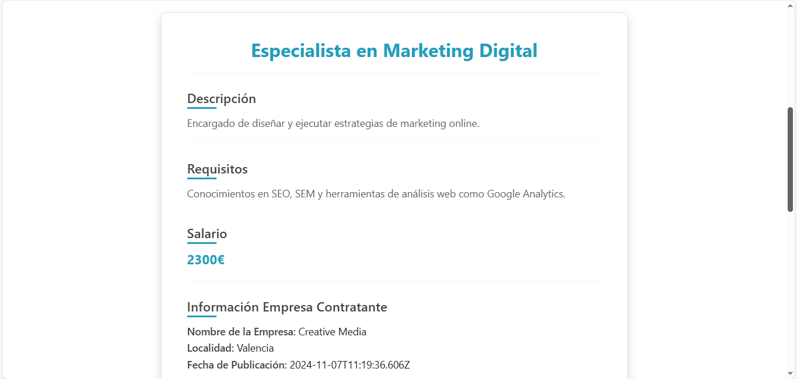

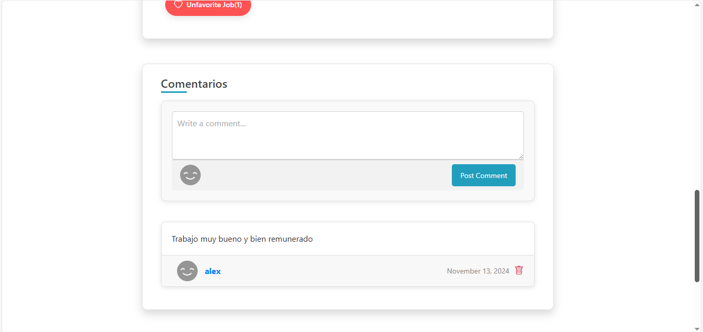
---

Esta vista permite que los usuarios tengan toda la información necesaria sobre la oferta de trabajo y interactúen con otros candidatos, mientras toman decisiones informadas sobre postularse.


### 📝🔑 Register y Login

La página de **Register** y **Login** permite que los usuarios se registren y accedan a la plataforma, ya sea como **candidatos**, **empresas**, o **administradores**. Ambas vistas cuentan con validaciones para asegurar que los datos introducidos sean correctos.

#### 📑 Register (Registro)

En la página de **Register**, los usuarios pueden crear una cuenta para acceder a la plataforma. Los candidatos pueden registrarse mediante el siguiente formulario:

- **Registro para Candidatos**: Los candidatos se registran mediante un formulario donde deben proporcionar su **email**, **nombre de usuario** y una **contraseña**. Las empresas y administradores son registrados a través del servidor directamente, sin necesidad de un formulario visible para ellos.
- **Validación de Datos Introducidos**:
  - **Campos Requeridos**: Todos los campos (email, nombre de usuario, y contraseña) son obligatorios. No se permitirá el envío del formulario si algún campo está vacío.
  - **Verificación de Email y Nombre de Usuario**: Se verifica que el **email** proporcionado no esté ya registrado en la plataforma. Igualmente, se valida que el **nombre de usuario** no haya sido utilizado por otro candidato. Si cualquiera de estos datos ya está en uso, se muestra un mensaje de error.
  - **Contraseña**: Esta contraseña se encripta utilizando **Argon2** antes de almacenarla en la base de datos para mayor seguridad.

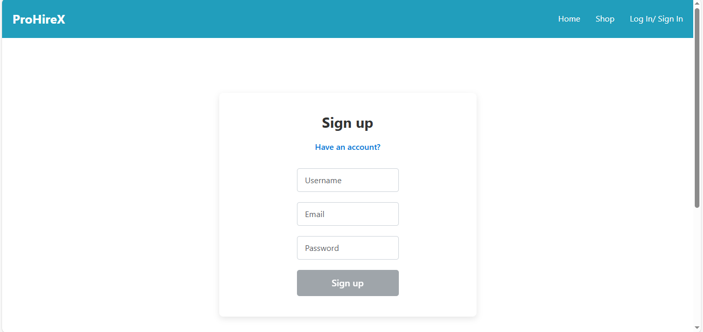

---

#### 🔑 Login (Acceso)

La página de **Login** permite a los usuarios acceder a su cuenta en la plataforma. Los candidatos, empresas y administradores pueden iniciar sesión desde el mismo formulario, diferenciándose por un **checkbox**.

- **Formulario de Login**: El formulario de login es el mismo para todos los tipos de usuarios (candidatos, empresas y administradores), pero el **checkbox** permite que el sistema identifique el tipo de usuario que está intentando acceder.
- **Validación de Datos Introducidos**:
  - **Campos Requeridos**: El **email** y la **contraseña** son obligatorios para poder acceder.
  - **Verificación de Usuario**: El sistema valida si el **usuario** proporcionado existe en la base de datos.
  - **Verificación de Contraseña**: La contraseña introducida se compara con la contraseña almacenada en la base de datos utilizando **Argon2** para asegurarse de que sea correcta. Si la contraseña no coincide, el sistema muestra un mensaje de error.

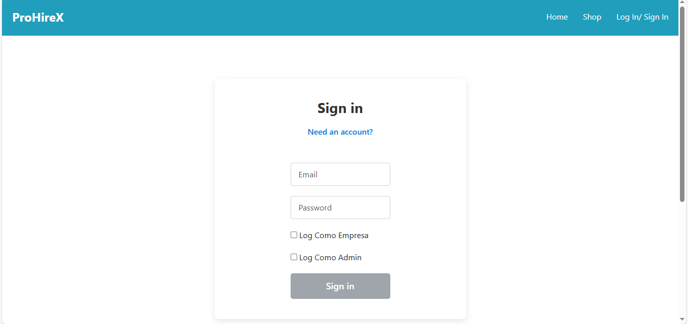

---

Estas vistas permiten un proceso de registro y login intuitivo, asegurando que los usuarios accedan a la plataforma de manera segura y adecuada según su rol (candidato, empresa o administrador).

### 🧑‍💻 Profile del Usuario Candidato

La página de **Perfil del Candidato** permite a los usuarios ver y editar su información personal, gestionar sus seguidores y seguidos, y acceder a los trabajos que han marcado como favoritos. Esta vista es esencial para que el usuario tenga un control completo sobre su experiencia en la plataforma.

#### 🖼️ Información del Candidato
En esta sección, el candidato puede ver su información básica, que incluye:
- **Nombre de Usuario**: El nombre de usuario único con el que se identifican en la plataforma.
- **Imagen de Perfil**: Foto de perfil del candidato, que puede ser modificada para actualizar su imagen.
- **Biografía**: Un pequeño resumen personal o profesional que el candidato ha proporcionado para describirse a sí mismo.

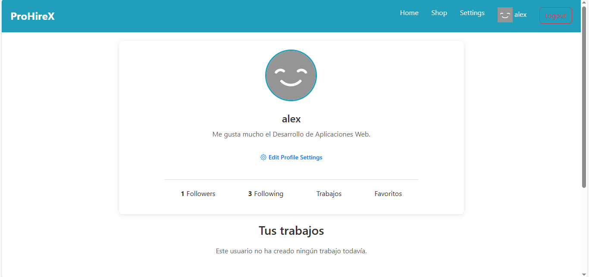

#### ✏️ Editar Datos Personales
Los usuarios tienen la opción de **editar sus datos personales** directamente desde su perfil. Esto incluye:
- **Cambiar la imagen de perfil**.
- **Actualizar su biografía**.
- **Modificar el nombre de usuario**, si lo desean, siempre y cuando no esté ya en uso.

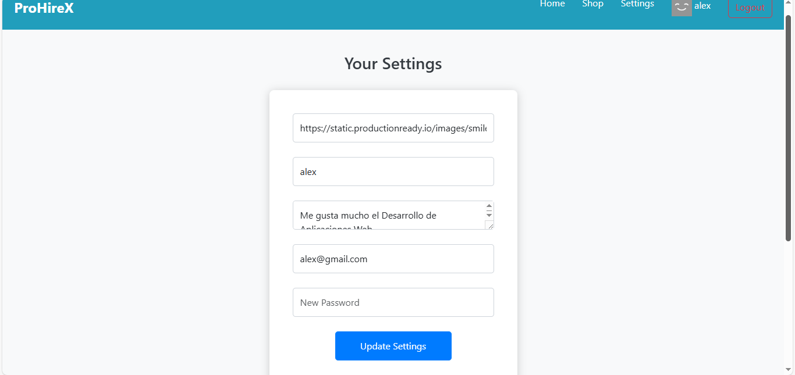

#### 👥 Seguidores y Seguidos
En esta sección, el candidato puede gestionar sus relaciones con otros usuarios de la plataforma:
- **Ver seguidores**: Lista de otros usuarios que siguen al candidato.
- **Ver seguidos**: Lista de usuarios que el candidato sigue.

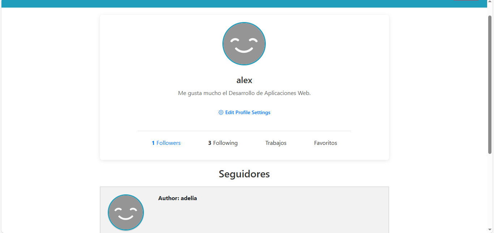

#### 💼 Trabajos Favoritos
Los candidatos pueden ver todas las ofertas de trabajo que han marcado como **favoritas**. Esto les permite tener un acceso rápido a las ofertas que les interesan, sin tener que buscar de nuevo.
- **Ver trabajos favoritos**: Una lista de todas las ofertas que el candidato ha marcado como favoritas.

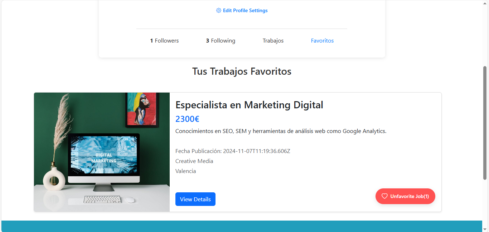

---

La página **Perfil del Usuario Candidato** ofrece una vista completa y personalizable para que el usuario gestione su información personal, sus relaciones con otros usuarios (seguidores y seguidos), y sus trabajos favoritos. Con la opción de editar sus datos, actualizar su imagen de perfil, y ver las ofertas de trabajo que más le interesan, esta sección proporciona una experiencia de usuario completa y optimizada. Esto permite a los candidatos tener un control total sobre su presencia en la plataforma y facilitar su interacción con otros usuarios

### 🏢 Dashboard de Empresa

La página de **Dashboard de Empresa** está diseñada para permitir a las empresas gestionar sus ofertas de trabajo de manera eficiente. Desde este panel, las empresas pueden ver el estado de sus ofertas, crear nuevas ofertas y mantener un control sobre todas las publicaciones activas.

#### 📝 Listado de Ofertas de Trabajo

El **Dashboard** muestra un listado de las ofertas de trabajo creadas por la empresa. Cada oferta se presenta en una tarjeta con los siguientes detalles:

- **Salario**: El rango salarial de la oferta.
- **Requisitos**: Los requisitos necesarios para el puesto.
- **Fecha de Publicación**: La fecha en que la oferta fue publicada.
- **Empresa y Localidad**: Información sobre la empresa y la ubicación de la oferta.
- **Estado de la Oferta**: El estado actual de la oferta, que puede ser:
  - **Completado**: Si la oferta ha sido resuelta (es decir, se ha contratado a alguien para el puesto).
  - **Rechazada**: Si el administrador ha rechazado la oferta.
  - **Pendiente**: Si el administrador aún no ha decidido si aceptar o rechazar la oferta.
  - **Aceptada**: Si el administrador ha aceptado la oferta.

Cada tarjeta proporciona un resumen visual claro del estado de la oferta, permitiendo a las empresas gestionar sus publicaciones de forma sencilla.

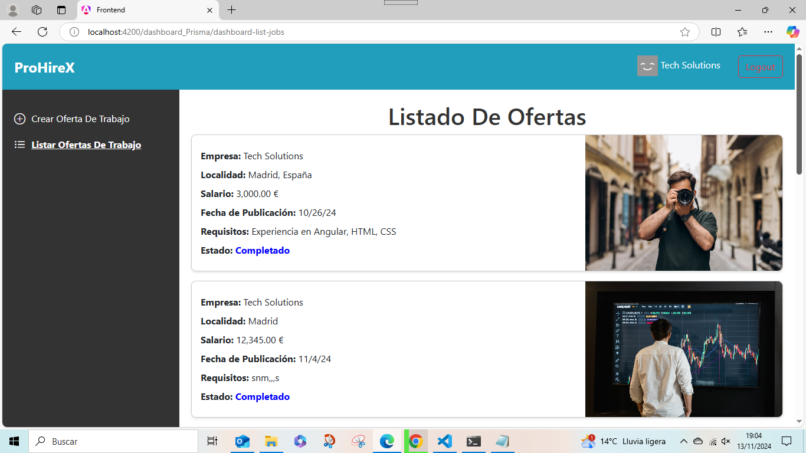

#### ✍️ Crear Ofertas

Las empresas pueden **crear nuevas ofertas de trabajo** desde el Dashboard. Para hacerlo, deben completar un formulario con los detalles necesarios de la oferta.

El formulario tiene una **validación de datos** para asegurarse de que todos los campos obligatorios estén completos y correctamente introducidos. Si algún dato falta o es incorrecto, el sistema notificará al usuario para corregirlo antes de enviar la oferta.

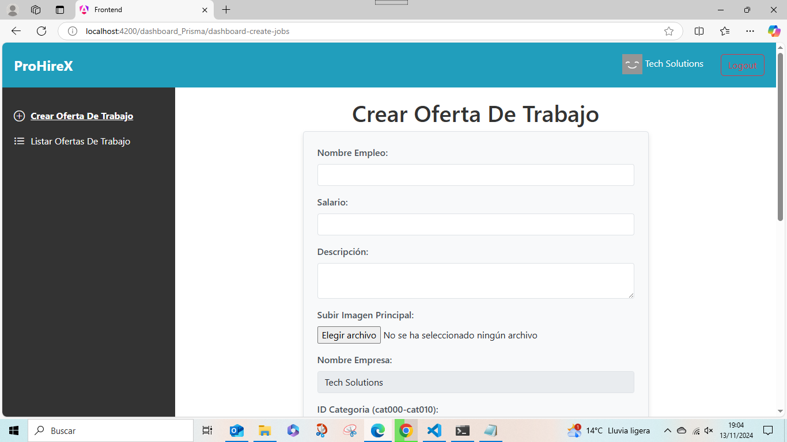

---

El **Dashboard de Empresa** proporciona a las empresas una interfaz intuitiva para gestionar sus ofertas de trabajo. Desde aquí, pueden visualizar el estado de cada oferta, crear nuevas publicaciones, y asegurarse de que todos los datos estén correctamente validados. Esto facilita la administración de ofertas y permite un flujo de trabajo más organizado y eficiente para las empresas.

### 🛠️ Dashboard de Administrador

El **Dashboard de Administrador** proporciona un control completo sobre las ofertas de trabajo publicadas por las empresas y las aplicaciones de los candidatos. Desde este panel, el administrador puede gestionar el estado de las ofertas, aceptarlas o rechazarlas, y decidir sobre las aplicaciones de los candidatos.

#### 📝 Listado de Ofertas Pendientes

El administrador puede ver todas las ofertas de trabajo que están **pendientes de revisión**. Cada oferta de trabajo se muestra en una tarjeta con los siguientes detalles:

- **Nombre del Oficio**: El título del trabajo.
- **Nombre de la Empresa**: La empresa que ha publicado la oferta.
- **Localidad**: Ubicación de la oferta.
- **Salario**: El rango salarial ofrecido.
- **Descripción**: Descripción detallada del trabajo y sus requisitos.

Cada tarjeta de oferta de trabajo tiene dos opciones de acción:

- **Aceptar**: Si el administrador acepta la oferta, esta se marcará como **Aceptada** y estará disponible para los candidatos. Además, la empresa recibirá una notificación de que su oferta ha sido aceptada.
- **Rechazar**: Si el administrador rechaza la oferta, esta no estará disponible para los candidatos y la empresa recibirá una notificación de que su oferta ha sido rechazada. El estado de la oferta se cambia a **Rechazado**.

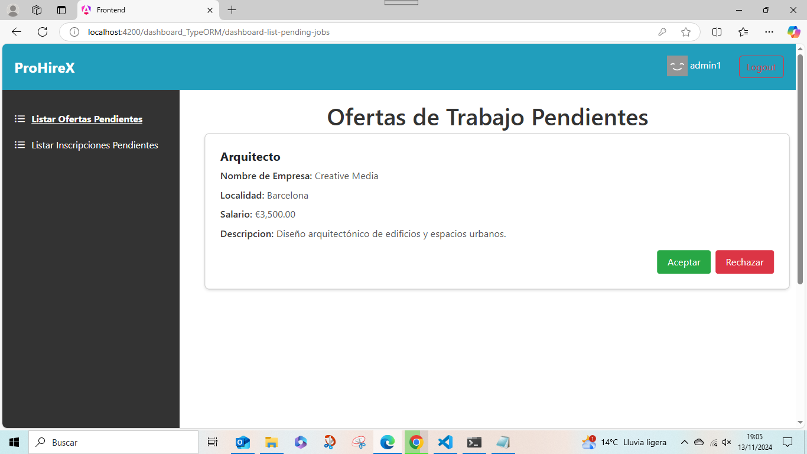

#### 📋 Listado de Aplicaciones a Ofertas Pendientes

El administrador también puede gestionar las **aplicaciones de los candidatos** a las ofertas de trabajo. Las aplicaciones pendientes se muestran en tarjetas con los siguientes detalles:

- **Nombre del Oficio**: El título del puesto solicitado.
- **Empresa**: La empresa que ha publicado la oferta.
- **Localidad**: Ubicación de la oferta.
- **Username del Candidato**: El nombre de usuario del candidato que se ha postulado.
- **Email del Candidato**: El correo electrónico del candidato.

El administrador tiene las siguientes opciones para gestionar las aplicaciones:

- **Aceptar**: Si el administrador acepta una aplicación, se marca como **Completado** y se notifica a la empresa que ha contratado al candidato. Esta oferta ya no estará disponible para otros candidatos.
- **Rechazar**: Si el administrador rechaza una aplicación, la oferta sigue disponible para otros candidatos.


---

El **Dashboard de Administrador** proporciona herramientas poderosas para gestionar el flujo de trabajo entre las ofertas de trabajo publicadas y las aplicaciones de los candidatos. El administrador puede aceptar o rechazar ofertas y aplicaciones, y se asegura de que el estado de las ofertas y las notificaciones a las empresas sean gestionados de manera adecuada. Esto ayuda a mantener el proceso de contratación organizado y eficiente, garantizando que las ofertas y los candidatos sean manejados de manera oportuna.

## 🚀 Como Ejecutar el Proyecto

Para ejecutar el proyecto, sigue estos pasos según el backend que deseas levantar:

### Para ejecutar el backend Candidato:

```bash
cd ./backend/app/api
npm install
node index.js
```

### Para ejecutar el backend Enterprise (Empresa):

```bash
cd ./backend_Prisma
npm install
npm run dev
```

### Para ejecutar el backend Administrador:

```bash
cd ./backend_TypeORM
npm install
npm run dev
```

### Para ejecutar el frontend:

```bash
cd ./frontend
npm install
ng serve
```